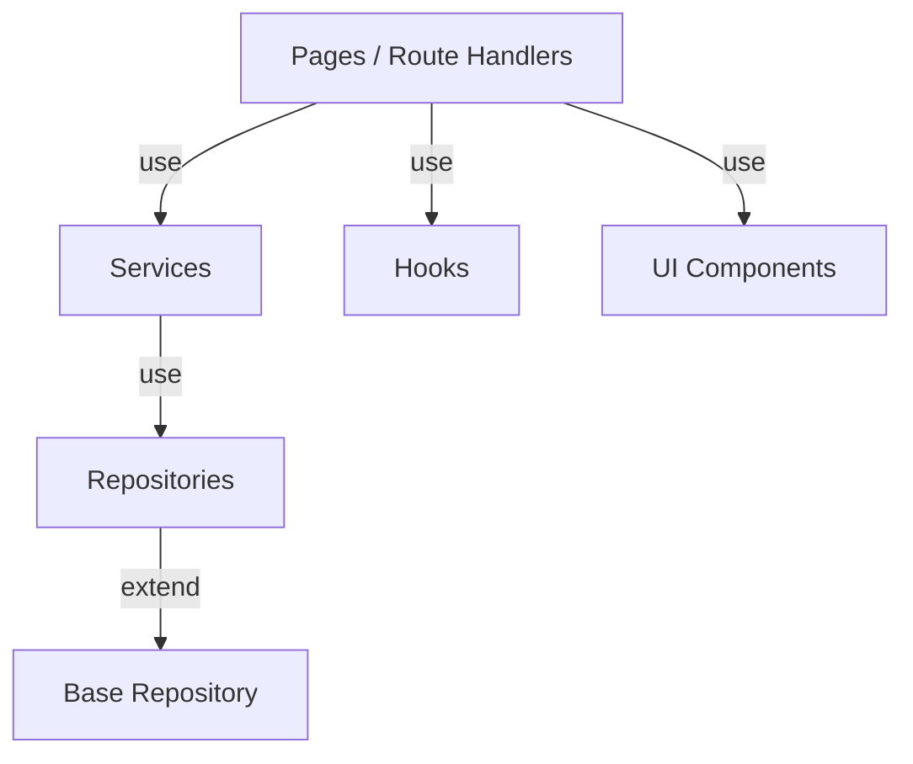

# BH-EDU File Dependencies

This document maps out the file dependencies within the BH-EDU project to ensure
safe modification and prevent cascading errors. Always check these dependencies
before making architectural changes.

## Core Hierarchy

## Dependency Map

### 1. Presentation Layer (Pages & Components)

- **`web/app/layout.tsx`**
  - _Depends on:_ `globals.css`, `<ThemeProvider>`, `<CustomizationProvider>`,
    `Header.tsx`, `Sidebar.tsx`
- **`web/components/Header.tsx`**
  - _Depends on:_ `SearchModal.tsx`, `NotificationsPanel.tsx`,
    `QuickActions.tsx`, `UserMenu.tsx`, `usePermissions` hook,
    `useNotifications` hook, `createClient` (supabase)
- **`web/components/Sidebar.tsx`**
  - _Depends on:_ `usePermissions` hook

### 2. Business Logic Layer (Services)

- **`web/lib/services/classService.ts`**
  - _Depends on:_ `ClassRepository`, `createClient`
- **`web/lib/services/courseService.ts`**
  - _Depends on:_ `CourseRepository`, `createClient`
- **`web/lib/services/studentService.ts`**
  - _Depends on:_ `StudentRepository`, `createClient`
- **`web/lib/services/attendanceService.ts`**
  - _Depends on:_ `AttendanceRepository`, `createClient`

### 3. Data Access Layer (Repositories)

- _All Repositories Depend on:_ `web/lib/repositories/base.ts` (BaseRepository)
- **`web/lib/repositories/ClassRepository.ts`**
  - _Depends on:_ Supabase Database Types, BaseRepository
- **`web/lib/repositories/CourseRepository.ts`**
  - _Depends on:_ Supabase Database Types, BaseRepository
- **`web/lib/repositories/StudentRepository.ts`**
  - _Depends on:_ Supabase Database Types, BaseRepository
- **`web/lib/repositories/AttendanceRepository.ts`**
  - _Depends on:_ Supabase Database Types, BaseRepository

### 4. Shared Utilities & Hooks

- **`web/hooks/useFetch.ts`**
  - _Depends on:_ API route structure (`/api/*`), standard API envelope format
    `{ data, error, message }`
- **`web/lib/grades/gpaCalculator.ts`**
  - _Depends on:_ Grading standards and coefficient logic (Pure function)
- **`web/lib/supabase/client.ts` (`server.ts`)**
  - _Depends on:_ `@supabase/ssr`, Next.js cookies/headers

### 5. API Routes

- _All API routes (`web/app/api/...`)_
  - _Depend on:_ `createClient` (from `web/lib/supabase/server.ts`), and their
    respective `Services`.

## Critical Update Rules

1. **If you change `BaseRepository`:** You MUST test all repository classes.
2. **If you change a `Service`:** You MUST test the specific service and its
   corresponding API routes.
3. **If you change `useFetch`:** You MUST test data loading across multiple
   pages (e.g., student list, class list).
4. **If you change Supabase Types (`supabase/types.ts`):** You MUST run
   TypeScript checks project-wide, specifically in repositories.
