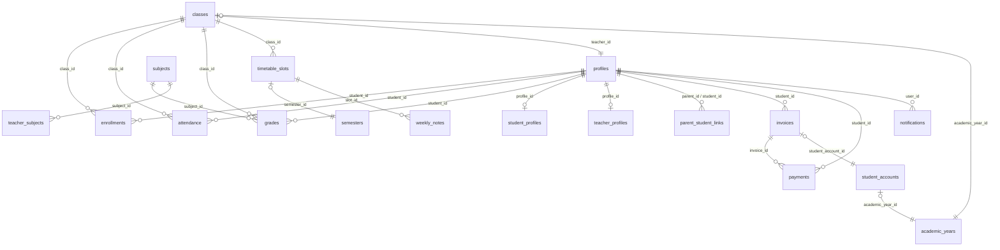

# 🔍 Báo cáo Phân tích & Đánh giá Database Schema BHEDU

> Audit toàn diện: Cấu trúc, Code đối chiếu, Tối ưu hóa

---

## I. PHÂN TÍCH CẤU TRÚC – Điểm yếu & Thiếu sót

### 🔴 Vấn đề Nghiêm trọng (P0 - Critical)

#### 1. Bảng Phantom: Code tham chiếu bảng KHÔNG TỒN TẠI trong schema

| Bảng Code gọi | File sử dụng | Bảng trong Schema |
|---|---|---|
| `conduct_grades` | [transcript/route.ts](file:///e:/TTGDBH/BH-EDU/web/app/api/students/[id]/transcript/route.ts#L236), [report-card/route.ts](file:///e:/TTGDBH/BH-EDU/web/app/api/students/[id]/report-card/route.ts#L241), [diagnostic/route.ts](file:///e:/TTGDBH/BH-EDU/web/app/api/diagnostic/route.ts#L114) | ❌ Không tồn tại. Bảng thực tế: **`student_conducts`** |
| `user_activity_logs` | [userService.ts](file:///e:/TTGDBH/BH-EDU/web/lib/services/userService.ts#L210), [reset-password/route.ts](file:///e:/TTGDBH/BH-EDU/web/app/api/admin/users/[id]/reset-password/route.ts#L57) | ❌ Không tồn tại trong schema |

> [!CAUTION]
> Đây là **runtime bugs** – các query này sẽ fail silently khi gọi. Cần sửa ngay.

#### 2. Dữ liệu Trùng lặp giữa `profiles` và bảng con

| Cột trùng lặp | `profiles` | `student_profiles` | `teacher_profiles` |
|---|---|---|---|
| `student_code` | ✅ `profiles.student_code` | ✅ `student_profiles.student_code` | – |
| `student_id` (text) | ✅ `profiles.student_id` | – | – |
| `grade_level` | ✅ `profiles.grade_level` | ✅ `student_profiles.grade_level` | – |
| `enrollment_date` | ✅ `profiles.enrollment_date` | ✅ `student_profiles.enrollment_date` | – |
| `department` | ✅ `profiles.department` | – | ✅ `teacher_profiles.department` |
| `notes` | ✅ `profiles.notes` | ✅ `student_profiles.notes` | – |

> [!WARNING]
> Khi cập nhật dữ liệu, nếu chỉ sửa 1 trong 2 nơi → **data inconsistency**. Cần chọn 1 nguồn sự thật (single source of truth) và loại bỏ cột trùng.

---

### 🟠 Vấn đề Đáng chú ý (P1 - High)

#### 3. FK bị thiếu & Quan hệ lỏng lẻo

| Bảng | Cột | Vấn đề |
|---|---|---|
| `classes` | `subject_group_id` | FK khai báo nhưng **không có bảng `subject_groups`** |
| `profiles` | `created_by` | Không có FK constraint → orphan records |
| `enrollments` | `created_by`, `updated_by` | Không có FK constraint |
| `attendance` | `created_by`, `updated_by` | Không có FK constraint |
| `classes` | `created_by`, `updated_by` | Không có FK constraint |
| `subjects` | `created_by`, `updated_by` | Không có FK constraint |
| `user_permissions` | `user_id` | Không có FK đến `profiles` hoặc `auth.users` |
| `user_permissions` | `granted_by` | Không có FK |
| `payment_allocations` | `payment_id`, `invoice_id` | Không có FK constraints |
| `payment_schedule_installments` | `id` | Cột `id` có DEFAULT nhưng **KHÔNG nằm trong PRIMARY KEY** |

#### 4. UNIQUE Constraints bị thiếu

| Bảng | Cần UNIQUE trên | Lý do |
|---|---|---|
| `enrollments` | `(student_id, class_id)` | Tránh đăng ký trùng |
| `attendance` | `(student_id, class_id, date)` | Tránh điểm danh trùng |
| `role_permissions` | `(role, permission_code)` | Tránh grant quyền trùng |
| `user_permissions` | `(user_id, permission_code)` | Tránh grant quyền trùng |
| `teacher_subjects` | `(profile_id, subject_id)` | Tránh liên kết trùng |
| `student_accounts` | `(student_id, academic_year_id)` | 1 học sinh/1 năm học = 1 tài khoản |
| `fee_assignments` | `(academic_year_id, fee_type_id, class_id)` | Tránh phân bổ phí trùng |

#### 5. Soft Delete không nhất quán

| Bảng CÓ `deleted_at` | Bảng KHÔNG CÓ `deleted_at` (nhưng nên có) |
|---|---|
| `profiles`, `enrollments`, `attendance`, `classes`, `subjects`, `timetable_slots`, `assignments`, `semesters`, `teacher_profiles`, `student_profiles` | `grades`, `invoices`, `payments`, `student_accounts`, `announcements`, `calendar_events`, `notifications`, `student_notes`, `student_documents` |

> [!IMPORTANT]
> `BaseRepository.delete()` thực hiện **HARD DELETE** (`supabase.delete()`), nhưng nhiều bảng hỗ trợ soft delete. Cần đồng bộ cơ chế xóa.

---

### 🟡 Vấn đề Cần cải tiến (P2 - Medium)

#### 6. Quy ước đặt tên không thống nhất

| Vấn đề | Ví dụ |
|---|---|
| `school_settings` vs `settings` | Hai bảng cùng mục đích – **nên merge** |
| `student_conducts` | Code gọi `conduct_grades` – tên bảng gây nhầm |
| `capacity` vs `max_capacity` trong `classes` | Hai cột cùng ý nghĩa |
| `status` trong `profiles` | VARCHAR vs `account_status` – hai cột track trạng thái |

#### 7. Thiếu `updated_at` trigger

Hầu hết bảng có cột `updated_at DEFAULT now()` nhưng **KHÔNG CÓ trigger tự cập nhật**. Khi `UPDATE`, cột `updated_at` giữ nguyên giá trị ban đầu trừ khi code tự set.

---

## II. ĐỐI CHIẾU CODE ↔ SCHEMA

### ✅ Bảng Đang Sử dụng Tích cực (21/~40)

| Bảng | Repo/Service/API |
|---|---|
| `profiles` | UserRepo, StudentRepo, TeacherRepo, DashboardRepo, + nhiều APIs |
| `enrollments` | EnrollmentRepo, StudentService, TimetableRepo |
| `attendance` | AttendanceRepo, ReportsRepo |
| `classes` | ClassRepo, TeacherRepo, DashboardRepo |
| `subjects` | SubjectService, GradeService |
| `grades` | GradeRepo, GradeService, ReportsRepo |
| `academic_years` | ReportsRepo, SettingsService, FinanceService |
| `semesters` | TimetableRepo |
| `timetable_slots` | TimetableRepo |
| `weekly_notes` | TimetableRepo |
| `settings` | TimetableRepo, SettingsService |
| `student_profiles` | StudentService, UserService |
| `teacher_profiles` | TeacherService, UserService |
| `student_notes` | API `/students/[id]/notes` |
| `student_documents` | API `/students/[id]/documents` |
| `notifications` | NotificationsCenter, hooks, APIs |
| `announcements` | Admin announcements pages, APIs |
| `audit_logs` | DashboardRepo, AuditService |
| `parent_student_links` | LinkService, transcript API |
| `invoices` | FinanceRepo, FinanceService |
| `payments` | FinanceRepo, FinanceService |
| `student_accounts` | FinanceRepo, FinanceService |

### ⚠️ Bảng Sử dụng Hạn chế (chỉ trong scripts/dump)

| Bảng | Nơi tham chiếu |
|---|---|
| `fee_types` | FinanceService (giới hạn), import script |
| `fee_assignments` | FinanceService (giới hạn) |
| `payment_methods` | FinanceRepo (giới hạn) |
| `tuition_config` | FinanceService (chỉ đọc) |
| `import_logs` / `import_errors` | Admin import students API |
| `calendar_events` | Calendar API |
| `user_invitations` | Auth verify-invite API |
| `permission_definitions` / `role_permissions` / `user_permissions` | Permissions pages |
| `assignment_categories` / `assignments` | Grades categories/assignments API |
| `teacher_subjects` | *(type def only)* |
| `grading_scales` | Admin grading-scales API |
| `attendance_reports` | Progress API (read only) |
| `curriculum_standards` | Curriculum API (standalone) |

### ❌ Bảng KHÔNG Sử dụng (Dead Tables)

| Bảng | Ghi chú |
|---|---|
| `school_settings` | Trùng với `settings` – **có thể xóa** |
| `qr_codes` | Có migration tạo nhưng **không có code sử dụng** |
| `evaluation_types` | Không có code tham chiếu |
| `student_conducts` | Code gọi `conduct_grades` thay vì bảng này |
| `payment_allocations` | Thiếu FK, không có code sử dụng |
| `payment_schedules` / `payment_schedule_installments` | Không có code sử dụng |
| `role_permission_overrides` | Không có code sử dụng (permissions dùng `role_permissions`) |
| `permission_audit_logs` | Có API `/admin/permissions/audit` nhưng rất hạn chế |

---

## III. TỐI ƯU INDEXING, CONSTRAINTS & QUAN HỆ

### A. Indexes Cần Thiết (Đề xuất)

```sql
-- =============================================
-- PERFORMANCE INDEXES (Dựa trên query patterns thực tế)
-- =============================================

-- 1. profiles: Tìm kiếm nhanh theo role, user_id, email
CREATE INDEX IF NOT EXISTS idx_profiles_role ON profiles(role) WHERE deleted_at IS NULL;
CREATE INDEX IF NOT EXISTS idx_profiles_email ON profiles(email) WHERE deleted_at IS NULL;
CREATE INDEX IF NOT EXISTS idx_profiles_student_code ON profiles(student_code) WHERE student_code IS NOT NULL;
CREATE INDEX IF NOT EXISTS idx_profiles_teacher_code ON profiles(teacher_code) WHERE teacher_code IS NOT NULL;
CREATE INDEX IF NOT EXISTS idx_profiles_status ON profiles(account_status) WHERE deleted_at IS NULL;

-- 2. enrollments: Join nhanh student-class
CREATE INDEX IF NOT EXISTS idx_enrollments_student ON enrollments(student_id) WHERE deleted_at IS NULL;
CREATE INDEX IF NOT EXISTS idx_enrollments_class ON enrollments(class_id) WHERE deleted_at IS NULL;
CREATE UNIQUE INDEX IF NOT EXISTS idx_enrollments_unique ON enrollments(student_id, class_id) WHERE deleted_at IS NULL;

-- 3. attendance: Query theo ngày, class, student
CREATE INDEX IF NOT EXISTS idx_attendance_date ON attendance(date DESC);
CREATE INDEX IF NOT EXISTS idx_attendance_class_date ON attendance(class_id, date DESC) WHERE deleted_at IS NULL;
CREATE INDEX IF NOT EXISTS idx_attendance_student_date ON attendance(student_id, date DESC) WHERE deleted_at IS NULL;
CREATE UNIQUE INDEX IF NOT EXISTS idx_attendance_unique ON attendance(student_id, class_id, date, timetable_slot_id) WHERE deleted_at IS NULL;

-- 4. grades: Query theo student, class, subject
CREATE INDEX IF NOT EXISTS idx_grades_student ON grades(student_id);
CREATE INDEX IF NOT EXISTS idx_grades_class ON grades(class_id);
CREATE INDEX IF NOT EXISTS idx_grades_subject ON grades(subject_id);
CREATE INDEX IF NOT EXISTS idx_grades_composite ON grades(student_id, class_id, component_type);

-- 5. timetable_slots: Lịch học theo ngày
CREATE INDEX IF NOT EXISTS idx_timetable_class_day ON timetable_slots(class_id, day_of_week) WHERE deleted_at IS NULL;
CREATE INDEX IF NOT EXISTS idx_timetable_teacher_day ON timetable_slots(teacher_id, day_of_week) WHERE deleted_at IS NULL;
CREATE INDEX IF NOT EXISTS idx_timetable_student_day ON timetable_slots(student_id, day_of_week) WHERE deleted_at IS NULL;

-- 6. classes: Join nhanh teacher
CREATE INDEX IF NOT EXISTS idx_classes_teacher ON classes(teacher_id) WHERE deleted_at IS NULL;
CREATE INDEX IF NOT EXISTS idx_classes_academic_year ON classes(academic_year_id) WHERE deleted_at IS NULL;

-- 7. invoices: Tài chính
CREATE INDEX IF NOT EXISTS idx_invoices_student ON invoices(student_id);
CREATE INDEX IF NOT EXISTS idx_invoices_status ON invoices(status);
CREATE INDEX IF NOT EXISTS idx_invoices_academic_year ON invoices(academic_year_id);
CREATE INDEX IF NOT EXISTS idx_invoices_due_date ON invoices(due_date) WHERE status IN ('pending', 'partial', 'overdue');

-- 8. payments: Giao dịch
CREATE INDEX IF NOT EXISTS idx_payments_student ON payments(student_id);
CREATE INDEX IF NOT EXISTS idx_payments_invoice ON payments(invoice_id);
CREATE INDEX IF NOT EXISTS idx_payments_date ON payments(payment_date DESC);

-- 9. notifications: Thông báo chưa đọc
CREATE INDEX IF NOT EXISTS idx_notifications_user_unread ON notifications(user_id, is_read) WHERE is_read = false;

-- 10. audit_logs: Lịch sử hoạt động
CREATE INDEX IF NOT EXISTS idx_audit_logs_user ON audit_logs(user_id);
CREATE INDEX IF NOT EXISTS idx_audit_logs_created ON audit_logs(created_at DESC);
CREATE INDEX IF NOT EXISTS idx_audit_logs_resource ON audit_logs(resource_type, resource_id);

-- 11. parent_student_links: Liên kết phụ huynh
CREATE INDEX IF NOT EXISTS idx_parent_links_parent ON parent_student_links(parent_id) WHERE status = 'approved';
CREATE INDEX IF NOT EXISTS idx_parent_links_student ON parent_student_links(student_id) WHERE status = 'approved';
```

### B. Missing FK Constraints

```sql
-- Thêm FK cho created_by/updated_by patterns
ALTER TABLE enrollments ADD CONSTRAINT enrollments_created_by_fkey
  FOREIGN KEY (created_by) REFERENCES profiles(id);
ALTER TABLE enrollments ADD CONSTRAINT enrollments_updated_by_fkey
  FOREIGN KEY (updated_by) REFERENCES profiles(id);

ALTER TABLE attendance ADD CONSTRAINT attendance_created_by_fkey
  FOREIGN KEY (created_by) REFERENCES profiles(id);
ALTER TABLE attendance ADD CONSTRAINT attendance_updated_by_fkey
  FOREIGN KEY (updated_by) REFERENCES profiles(id);

ALTER TABLE classes ADD CONSTRAINT classes_created_by_fkey
  FOREIGN KEY (created_by) REFERENCES profiles(id);
ALTER TABLE classes ADD CONSTRAINT classes_updated_by_fkey
  FOREIGN KEY (updated_by) REFERENCES profiles(id);

-- payment_allocations
ALTER TABLE payment_allocations ADD CONSTRAINT payment_allocations_payment_fkey
  FOREIGN KEY (payment_id) REFERENCES payments(id);
ALTER TABLE payment_allocations ADD CONSTRAINT payment_allocations_invoice_fkey
  FOREIGN KEY (invoice_id) REFERENCES invoices(id);

-- user_permissions
ALTER TABLE user_permissions ADD CONSTRAINT user_permissions_user_fkey
  FOREIGN KEY (user_id) REFERENCES profiles(id);
ALTER TABLE user_permissions ADD CONSTRAINT user_permissions_granted_by_fkey
  FOREIGN KEY (granted_by) REFERENCES profiles(id);
```

### C. Updated_at Trigger (cần áp dụng cho TẤT CẢ bảng có cột updated_at)

```sql
CREATE OR REPLACE FUNCTION update_updated_at()
RETURNS TRIGGER AS $$
BEGIN
  NEW.updated_at = now();
  RETURN NEW;
END;
$$ LANGUAGE plpgsql;

-- Áp dụng cho tất cả bảng có updated_at
DO $$
DECLARE
  tbl text;
BEGIN
  FOR tbl IN
    SELECT table_name FROM information_schema.columns
    WHERE column_name = 'updated_at'
      AND table_schema = 'public'
  LOOP
    EXECUTE format(
      'CREATE TRIGGER IF NOT EXISTS trigger_updated_at BEFORE UPDATE ON %I
       FOR EACH ROW EXECUTE FUNCTION update_updated_at()',
      tbl
    );
  END LOOP;
END;
$$;
```

---

## IV. KHUYẾN NGHỊ ƯU TIÊN HÀNH ĐỘNG

### 🔴 Ngay lập tức (Hotfix)

| # | Hành động | Chi tiết |
|---|---|---|
| 1 | **Sửa `conduct_grades` → `student_conducts`** | 3 file API đang gọi sai tên bảng |
| 2 | **Tạo bảng `user_activity_logs`** hoặc sửa code | 2 file đang ghi vào bảng không tồn tại |
| 3 | **Xóa cột `subject_group_id`** khỏi `classes` | FK orphan, không có bảng tương ứng |

### 🟠 Tuần này

| # | Hành động |
|---|---|
| 4 | Thêm UNIQUE constraints cho `enrollments`, `attendance`, `role_permissions` |
| 5 | Thêm performance indexes (Section III.A) |
| 6 | Chạy migration thêm `updated_at` trigger |
| 7 | Loại bỏ cột trùng lặp giữa `profiles` ↔ `student_profiles` / `teacher_profiles` |

### 🟡 Tháng này

| # | Hành động |
|---|---|
| 8 | Xóa/Archive dead tables: `school_settings`, `qr_codes`, `evaluation_types`, `payment_schedules` |
| 9 | Merge `capacity` và `max_capacity` trong `classes` |
| 10 | Thống nhất soft delete: cập nhật `BaseRepository.delete()` để dùng soft delete |
| 11 | Thêm missing FK constraints (Section III.B) |
| 12 | Đồng bộ tên bảng `student_conducts` → rename hoặc tạo alias/view |

---

## V. SƠ ĐỒ QUAN HỆ CHÍNH (Mermaid)


